<div align="center">

# Enterprise AI Workspace

### 企业智能知识与业务协同平台

**让 AI 不只“回答问题”，而是理解企业上下文、基于证据给出答案，并把自然语言继续推进到真实业务流程。**

[](https://react.dev/)
[](https://www.typescriptlang.org/)
[](https://fastapi.tiangolo.com/)
[](https://www.python.org/)
[](#测试与质量)
[](#项目真正智能在哪里)

[核心亮点](#核心亮点) · [真实运行效果](#真实运行效果) · [智能化设计](#项目真正智能在哪里) · [功能全景](#功能全景) · [技术实现](#技术实现) · [快速开始](#快速开始)

</div>

---

## 一眼看懂这个项目

这是一个面向企业内部场景的 **AI 工作空间**。系统把知识库、组织权限、项目合同、协作工单、请假考勤、费用审批、薪酬发放与审计能力放进同一套业务模型中，再以对话作为统一入口。

用户可以直接问：

- “年假最多多少天？” —— 系统在当前用户可访问的知识范围内完成检索、引用和回答。
- “帮我申请明天下午请假。” —— 系统识别为办事请求，解析请假类型与日期，生成结构化预览，确认后进入正式流程。
- “今天客户拜访打车 86 元，帮我报销。” —— 系统提取金额、费用类型等字段，生成报销预览，确认后进入审批。
- “电脑连不上公司网络，帮我发个工单。” —— 系统生成工单预览，并继续进入派发、待办、通知和处理闭环。

**项目重点不是做一个“套了聊天框的 RAG Demo”，而是验证 AI 如何真正进入企业业务系统。**

### AI 工作台

下面是项目真实运行界面。左侧是知识与业务上下文，中间是对话区，右侧展示 Agent 执行阶段；用户还能调整上下文深度与知识范围。

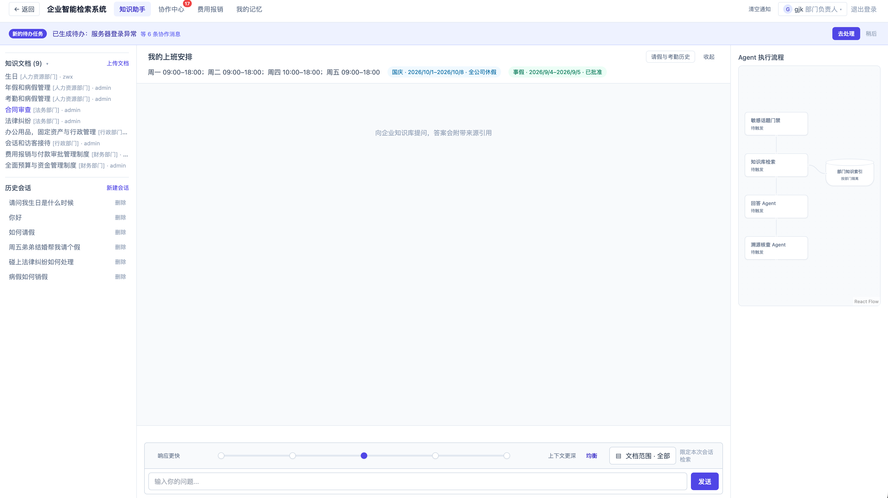

---

## 核心亮点

| 能力 | 本项目实现 | 价值 |
| --- | --- | --- |
| **上下文感知问答** | 会话历史、会话摘要、个人记忆、部门记忆、指定文档范围共同参与上下文组装 | 不把每一轮问答当成孤立请求 |
| **企业级 RAG** | BM25 + 向量语义混合检索，按部门权限和文档范围检索 | 既能匹配关键词，也能理解语义，同时避免越权知识泄露 |
| **追问理解** | 对依赖上下文的追问自动改写为可独立检索的问题 | “那它多久生效？”这类追问也能正确检索 |
| **证据约束回答** | 检索片段进入回答上下文，流式输出并展示引用来源 | 回答不是只靠模型记忆“自由发挥” |
| **回答可信度检查** | 主回答完成后继续进行异步 faithfulness check | 在不阻塞首屏回答的前提下补充质量检查 |
| **自然语言办事** | 请假、报销、工单请求可从聊天中识别并生成结构化业务预览 | 从“知道答案”继续走到“完成工作” |
| **Human-in-the-loop** | 关键写操作先展示预览，再由用户确认提交 | AI 降低操作成本，但不越过人的最终决策 |
| **真实业务闭环** | 审批、待办、通知、付款、薪酬、考勤、项目、合同与审计均有实际页面和状态 | AI 能力不是孤立功能，而是嵌入业务系统 |
| **敏感问题治理** | 敏感词配置、命中记录、审计追踪，并在查询改写后再次检查 | 兼顾可用性与企业内部风险控制 |

---

## 项目真正智能在哪里

### 1. 不是“问题直接丢给大模型”

一次知识问答会经过多个明确阶段：

| 阶段 | 处理内容 |
| --- | --- |
| 安全检查 | 检查当前问题是否命中敏感规则 |
| 上下文判断 | 判断问题是否依赖历史对话 |
| 查询改写 | 必要时把追问改写成独立、可检索的问题 |
| 权限与知识范围 | 根据当前用户部门、会话配置、指定文档决定可检索范围 |
| 混合检索 | 对授权范围内文档进行 BM25 + 向量语义检索 |
| 上下文组装 | 合并证据、部门记忆、个人记忆、会话摘要和历史消息 |
| 流式回答 | 逐 token 输出答案，并保留引用标记 |
| 可信度检查 | 回答展示后继续检查回答是否得到检索证据支持 |

也就是说，**LLM 负责它擅长的理解与生成，权限、检索、状态和审计则由确定性的应用逻辑控制。**

### 2. 检索不是“搜全库”

系统会先确定当前用户真正有权访问的知识，再执行检索：

- 支持按多个授权部门联合检索；
- 支持会话级“全部文档 / 指定文档”知识范围；
- BM25 与向量检索分别计算后归一化加权；
- 当前实现默认权重为 **BM25 0.4 + Embedding 0.6**；
- 每个授权部门先检索，再合并最强证据；
- 找不到有效证据时直接提示知识不足，而不是强行生成答案。

### 3. 多轮对话真正影响下一次检索

当用户问出“那这个多久生效？”“这个规则对我们部门也一样吗？”之类依赖历史的问题时，系统可以利用会话历史与摘要把它改写成独立查询，再去检索知识库。

这解决了很多简单 RAG 项目常见的问题：**聊天看起来是多轮的，但每一次检索其实仍然只搜当前一句话。**

### 4. 回答有证据，还有后置质量检查

主回答通过 SSE 流式返回，检索到的文档片段会转换成引用元数据。回答完成后，系统继续执行 faithfulness check，检查回答与检索证据之间是否存在明显不一致。

这里刻意把质量检查放在主回答之后，避免用户为了“等检查”而等待更久。

### 5. AI 能从“问”继续走到“办”

项目把聊天页同时做成了业务入口。请假、费用报销和协作工单等请求会先经过轻量意图识别，再从自然语言中抽取可确定字段，生成结构化预览。

例如：

> 用户输入：今天客户拜访打车 86 元，帮我报销。
>
> 系统预览：费用类型 = 交通、金额 = 86、事由 = 客户拜访……
>
> 用户确认后，才创建正式费用记录并进入审批。

这种设计没有把所有步骤都交给 LLM。对于金额、日期、状态迁移等需要稳定性的业务字段，优先使用可验证的规则与后端校验；LLM 主要用于知识理解、查询改写和答案生成。

### 6. AI 与企业权限、组织关系和审计共用同一套系统

知识问答不是独立部署在业务系统旁边。文档可以关联部门、项目和合同；员工属于不同部门并拥有不同角色；敏感问题、业务操作、审批和付款都能够留下记录。

因此这个项目展示的不只是“模型能力”，更重要的是 **AI 如何进入一个有权限、有状态、有关系、有审计的企业应用。**

---

# 真实运行效果

以下截图全部来自项目实际运行环境。为了 README 更容易浏览，按业务场景分组展示。

## 1. 组织、权限与员工关系

<table>
  <tr>
    <td width="50%" valign="top">
      <strong>组织与员工总览</strong><br/><br/>
      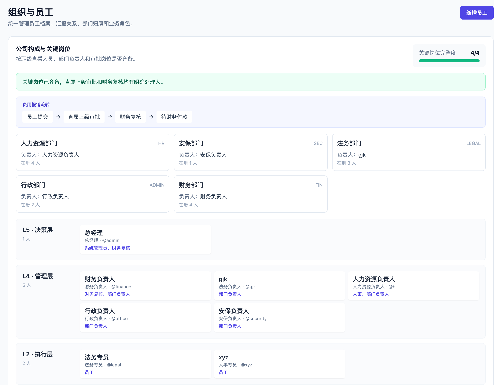
      <br/>部门结构、负责人、员工数量与组织层级统一展示。
    </td>
    <td width="50%" valign="top">
      <strong>部门工作空间</strong><br/><br/>
      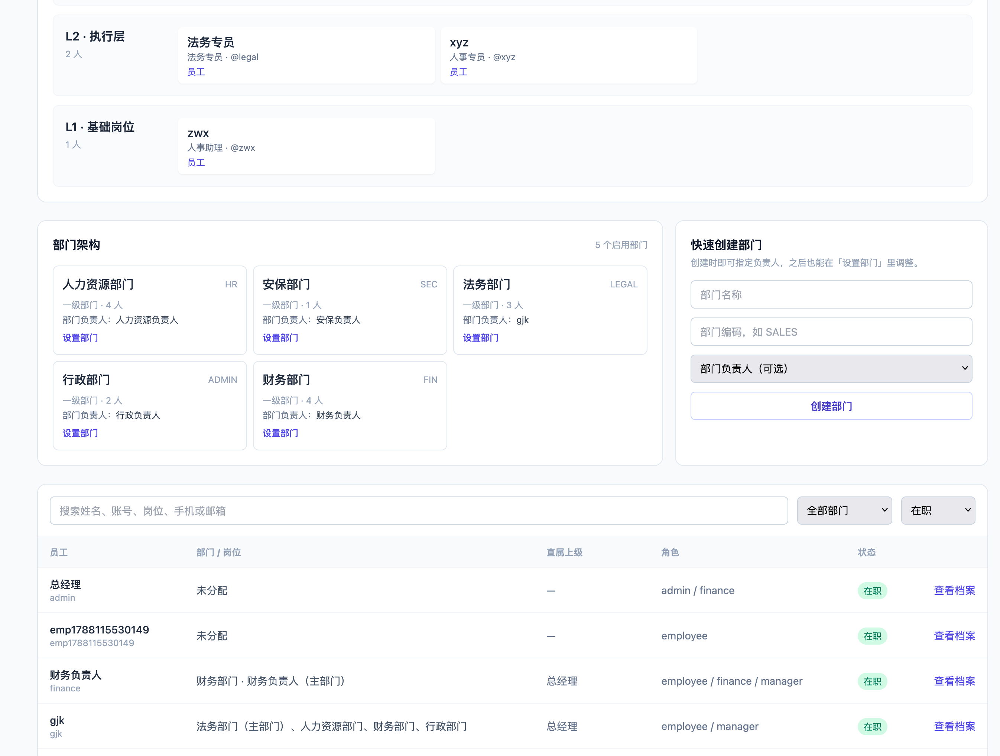
      <br/>从部门继续查看组织层级、部门档案和员工目录。
    </td>
  </tr>
</table>

<table>
  <tr>
    <td width="50%" valign="top">
      <strong>员工账号与多部门成员关系</strong><br/><br/>
      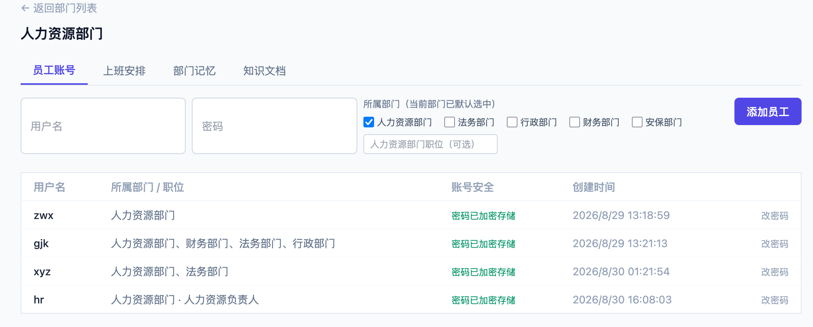
      <br/>支持员工加入多个部门，并维护账号与组织关系。
    </td>
    <td width="50%" valign="top">
      <strong>排班与员工请假记录</strong><br/><br/>
      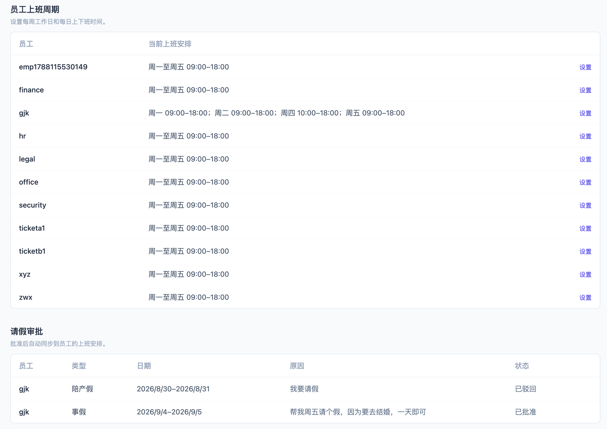
      <br/>员工工作时间、请假状态与历史记录可以统一追踪。
    </td>
  </tr>
</table>

## 2. 考勤、排班与薪酬自动化

<table>
  <tr>
    <td width="50%" valign="top">
      <strong>排班与考勤管理</strong><br/><br/>
      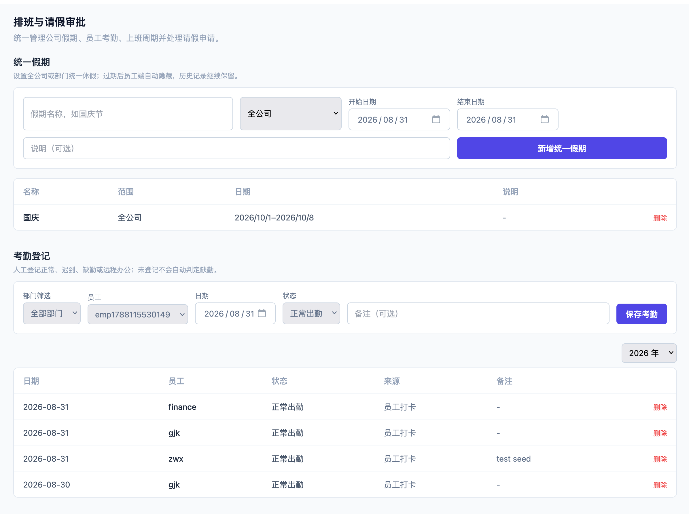
      <br/>统一维护假期、考勤记录、员工状态并处理请假申请。
    </td>
    <td width="50%" valign="top">
      <strong>薪酬与发薪规则</strong><br/><br/>
      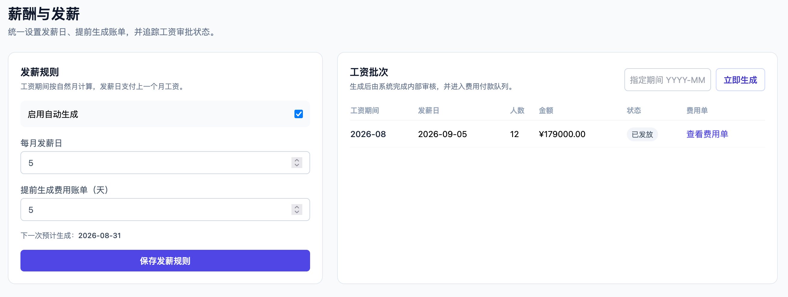
      <br/>配置发薪日和提前生成周期，并生成工资批次进入后续流程。
    </td>
  </tr>
</table>

<table>
  <tr>
    <td width="50%" valign="top">
      <strong>工资批次自动生成费用</strong><br/><br/>
      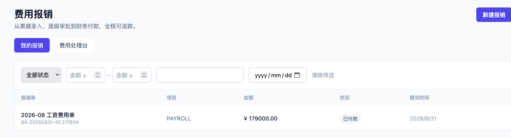
      <br/>工资不止停留在静态工资表，而是继续进入费用、审批和付款闭环。
    </td>
    <td width="50%" valign="top">
      <strong>管理驾驶舱</strong><br/><br/>
      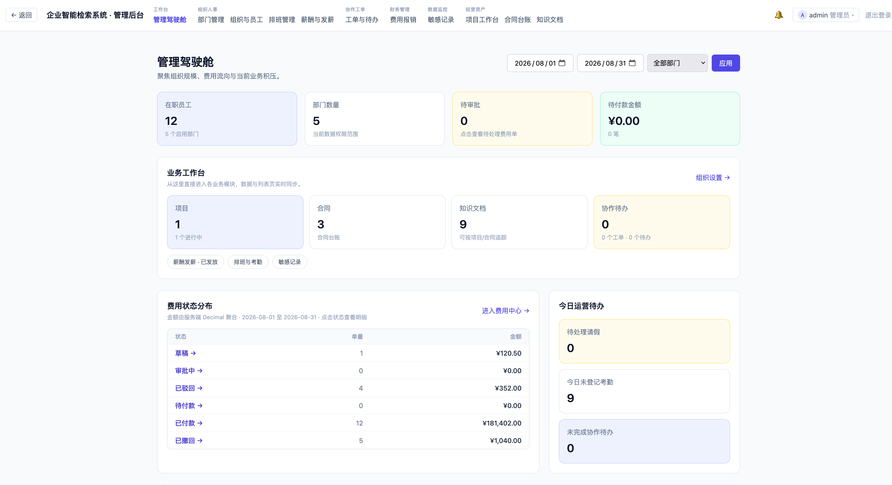
      <br/>组织、项目、合同、知识、费用和运营待办集中汇总，并支持下钻。
    </td>
  </tr>
</table>

## 3. 费用、审批与经营闭环

<table>
  <tr>
    <td width="50%" valign="top">
      <strong>员工费用记录</strong><br/><br/>
      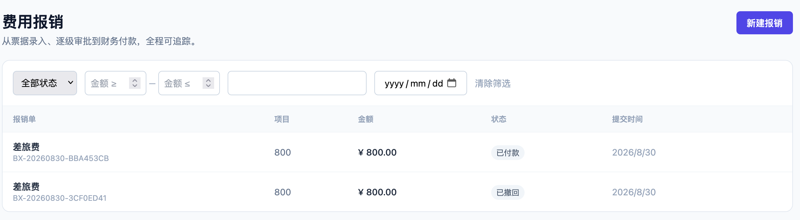
      <br/>员工可查看自己的报销进度和历史状态。
    </td>
    <td width="50%" valign="top">
      <strong>财务费用处理台</strong><br/><br/>
      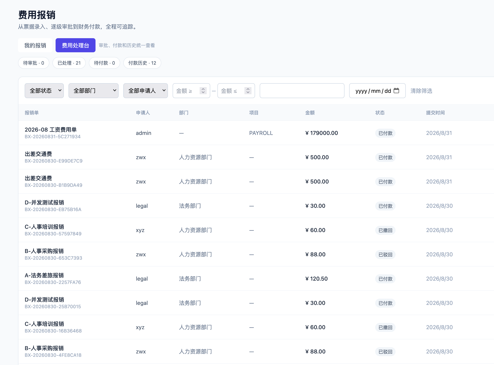
      <br/>待审批、已处理、待付款和付款历史在同一工作台完成。
    </td>
  </tr>
</table>

<p align="center">
  <strong>费用状态与月份下钻</strong><br/><br/>
  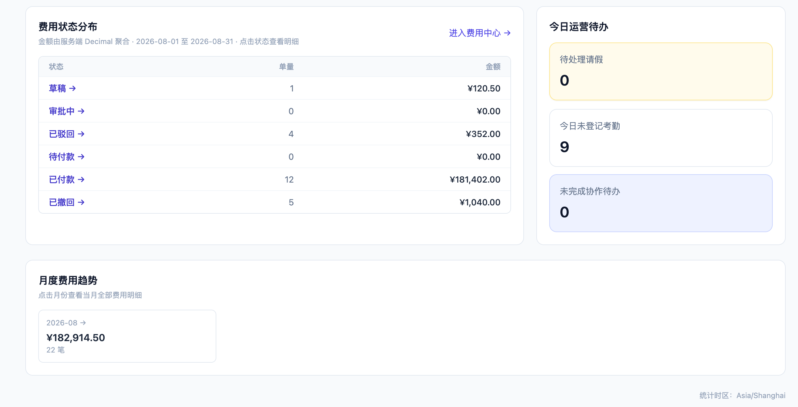
</p>

驾驶舱展示费用状态分布和月度趋势，点击状态或月份后可继续进入明细页面处理。

## 4. 协作、工单与待办

<table>
  <tr>
    <td width="50%" valign="top">
      <strong>员工协作中心</strong><br/><br/>
      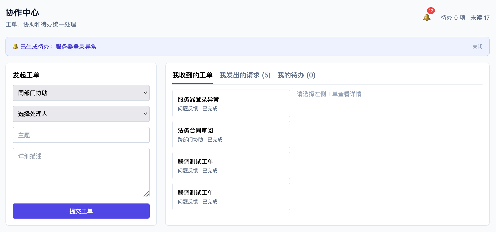
      <br/>员工可发起同部门/跨部门协作，请求进入明确的处理状态。
    </td>
    <td width="50%" valign="top">
      <strong>工单与待办处理台</strong><br/><br/>
      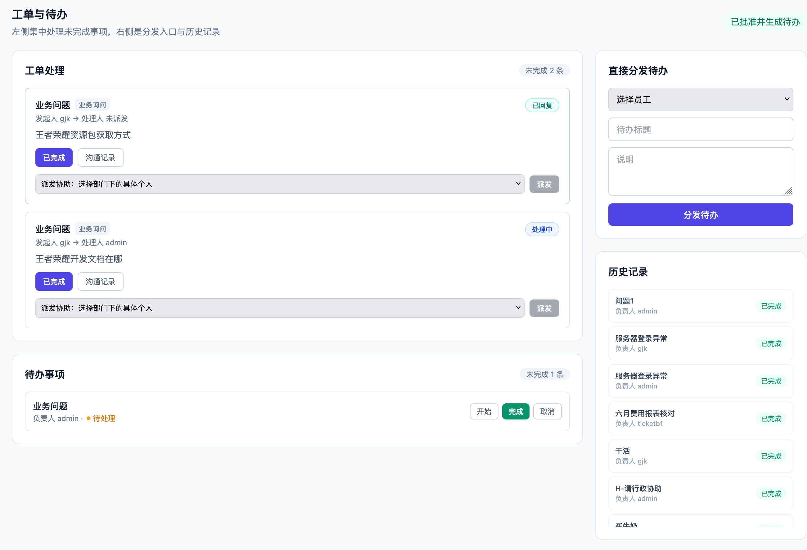
      <br/>工单处理、直接分发待办和历史记录形成完整协作链路。
    </td>
  </tr>
</table>

## 5. 项目、合同与知识资产

<table>
  <tr>
    <td width="50%" valign="top">
      <strong>项目管理</strong><br/><br/>
      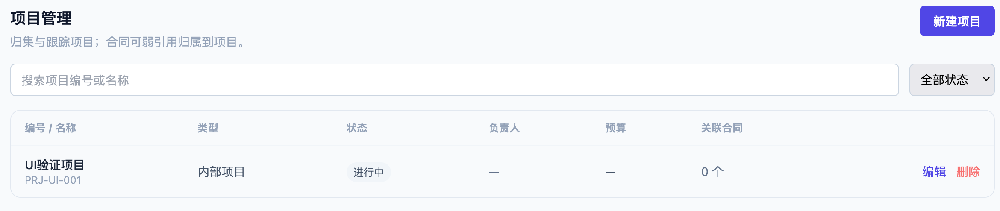
      <br/>项目维护负责人、预算、状态，并作为合同与文档的业务锚点。
    </td>
    <td width="50%" valign="top">
      <strong>合同管理</strong><br/><br/>
      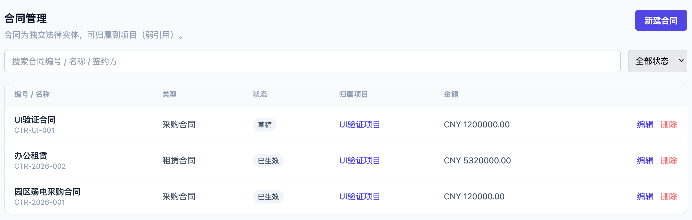
      <br/>合同可关联项目，形成业务资产之间的可追踪关系。
    </td>
  </tr>
</table>

<p align="center">
  <strong>知识文档</strong><br/><br/>
  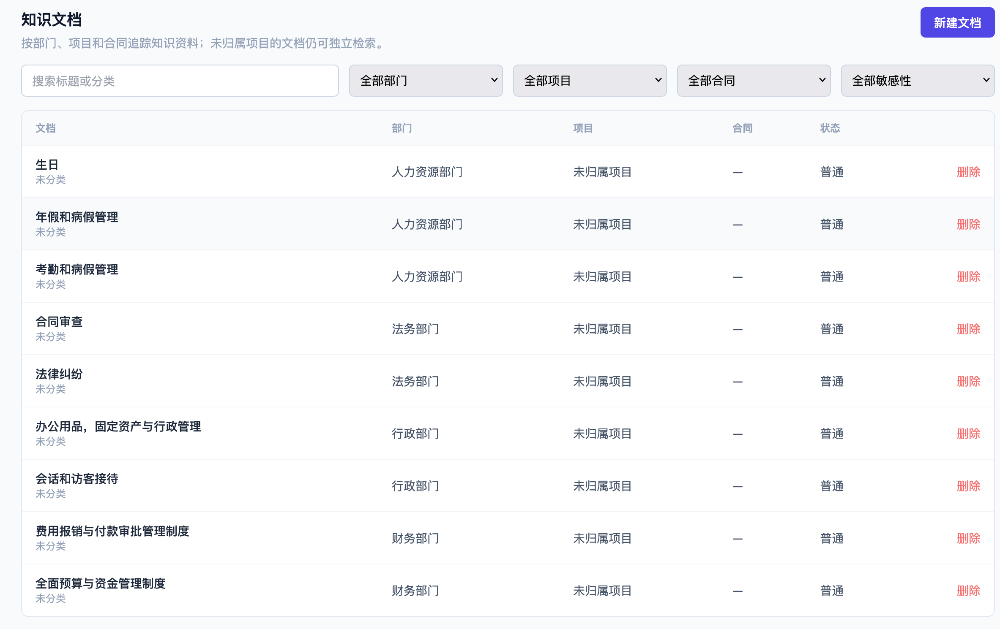
</p>

文档可按部门、项目、合同和敏感性进行管理，并作为 AI 检索时的授权知识范围。

## 6. 安全、敏感治理与审计

<table>
  <tr>
    <td width="50%" valign="top">
      <strong>敏感关键词配置</strong><br/><br/>
      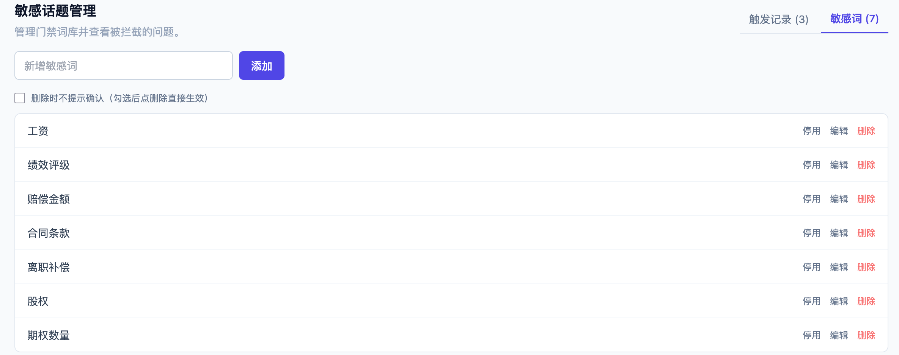
      <br/>管理员可维护需要拦截或关注的敏感关键词。
    </td>
    <td width="50%" valign="top">
      <strong>敏感命中记录</strong><br/><br/>
      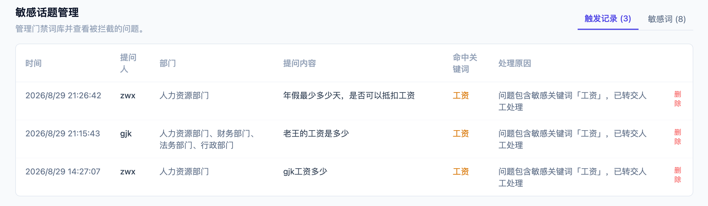
      <br/>记录提问人、部门、问题、命中关键词与处理原因，便于追踪。
    </td>
  </tr>
</table>

<p align="center">
  <strong>系统操作审计</strong><br/><br/>
  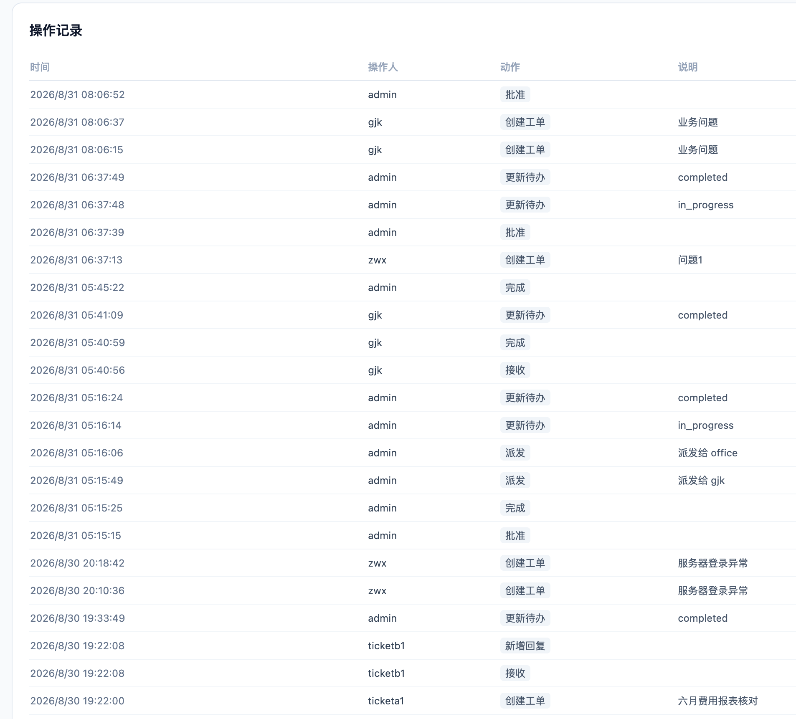
</p>

关键业务操作以时间、操作者、动作和说明形式留下可追踪记录。

---

## 功能全景

### AI 知识助手

- 多轮会话与历史会话管理
- 会话级上下文深度设置
- 个人记忆、部门记忆与会话摘要
- 追问查询改写
- 部门权限与指定文档知识范围
- BM25 + Embedding 混合检索
- SSE 流式回答
- 引用来源展示
- 回答 faithfulness check
- 敏感内容拦截与审计

### 对话驱动业务操作

- 自然语言请假意图识别与日期解析
- 自然语言费用识别、金额与类型抽取
- 自然语言工单识别、主题/部门/处理人抽取
- 结构化预览
- 用户确认后正式写入
- 与审批、待办、通知等业务状态继续联动

### 组织与员工

- 多级部门结构
- 员工账号与员工档案
- 一名员工加入多个部门
- 直属上级和组织层级
- 管理员 / 人事 / 财务 / 经理 / 员工等角色
- 入职、调岗、离职等组织事件

### 排班、考勤与请假

- 每周工作时间配置
- 公司/部门假期
- 员工考勤记录
- 请假申请、审核与历史追踪
- 工作日与请假区间校验
- 管理端统一查看员工排班与请假状态

### 项目、合同与知识关系

- 项目台账、负责人、预算和状态
- 合同金额、相对方、履约周期与状态
- 合同关联项目
- 文档关联部门、项目、合同和所有者
- 项目工作台聚合上下游业务资产

### 协作中心

- 同部门 / 跨部门 / 问题反馈等工单类型
- 工单处理人、优先级与状态
- 工单消息沟通
- 派发与待办生成
- 完成、关闭、拒绝、重新打开等状态约束
- 站内通知与未读提醒

### 费用、审批与付款

- 费用草稿与明细项
- 自然语言费用预览
- 多级审批链路
- 当前节点、当前处理人、后续节点展示
- 提交、撤回、驳回、待付款、已付款状态闭环
- 财务处理台与多维筛选
- 付款记录

### 薪酬与发薪

- 员工薪资配置
- 每月发薪日
- 提前生成工资批次
- 自动生成工资费用账单
- 审批完成后进入付款队列
- 薪酬与费用付款记录联动

### 管理驾驶舱与审计

- 员工、部门、费用、项目、合同、知识等关键指标
- 费用状态分布和月度趋势
- 指标和月份下钻
- 今日请假、考勤缺失、协作待办
- 敏感命中记录
- 关键业务操作审计

---

## 技术实现

### 技术栈

| 层级 | 技术 |
| --- | --- |
| 前端 | React 19、TypeScript 6、Vite 8、Tailwind CSS、React Router、Zustand、XYFlow |
| 后端 | Python 3.12、FastAPI、Pydantic、SQLAlchemy、Uvicorn |
| AI 与检索 | OpenAI 兼容模型接口、Sentence Transformers、BM25、Tiktoken |
| 数据与安全 | SQLite、JWT、Argon2、Cryptography、Alembic |
| 通信 | REST API、Server-Sent Events |
| 测试与质量 | Python unittest、TypeScript 可执行测试、Oxlint、TypeScript Compiler |

### 后端 AI 模块

```text
backend/app/
├── agents/
│   ├── orchestrator.py          # AI 请求主编排、SSE Pipeline 事件
│   ├── answer.py                # 流式回答与引用标记
│   ├── faithfulness_check.py    # 回答后置可信度检查
│   └── sensitive_gate.py        # 敏感问题门控
├── context/
│   ├── query.py                 # 追问改写
│   ├── prompt.py                # 上下文与证据组装
│   └── service.py               # 会话/个人/部门记忆
├── kb/
│   ├── retriever.py             # BM25 + 向量混合检索
│   ├── index_cache.py           # 部门级检索索引缓存
│   ├── embedding.py             # 向量编码与相似度
│   └── chunking.py              # 文档切分
└── workflow/
    └── service.py               # 审批工作流
```

### 为什么没有把所有智能化都交给 LLM

这是项目里比较重要的一点：

- **需要语义理解的地方**：使用模型，例如追问改写、知识回答、回答可信度检查；
- **需要稳定和低延迟的地方**：使用明确规则，例如请假/报销/工单的初步意图判断和字段抽取；
- **需要强一致性的地方**：交给后端业务服务，例如权限、状态迁移、审批、付款和写数据库；
- **需要最终决策的地方**：保留用户确认。

这样做比“所有请求都让一个大模型决定下一步”更适合企业业务场景。

---

## 权限与安全

系统把“能看到什么”和“能做什么”作为业务模型的一部分：

- JWT 身份认证
- 基于角色的访问控制
- 部门数据范围隔离
- 文档所有权和部门写权限
- 员工多部门成员关系
- 密码使用 Argon2 哈希
- 敏感配置通过环境变量注入
- 关键业务动作写入审计日志
- 敏感关键词触发记录
- 报销附件按权限下载
- 乐观锁版本字段降低并发覆盖风险

> 仓库不会包含本地 `.env`、数据库、票据附件、工资数据或真实业务记录。生产部署前应更换 JWT 密钥、加密密钥和初始管理员密码。

---

## 目录结构

```text
enterprise-kb-system/
├── backend/
│   ├── app/
│   │   ├── agents/          # AI 编排、回答与可信度检查
│   │   ├── audit/           # 审计服务
│   │   ├── context/         # 对话上下文、查询改写与记忆
│   │   ├── dashboard/       # 管理驾驶舱聚合
│   │   ├── kb/              # 文档切分、向量、BM25 与检索
│   │   ├── payroll/         # 薪酬批次与费用生成
│   │   ├── routers/         # REST / SSE API
│   │   ├── schedule/        # 排班、考勤与请假
│   │   └── workflow/        # 审批工作流
│   ├── migrations/          # Alembic 迁移
│   └── tests/               # 后端测试
├── frontend/
│   ├── src/
│   │   ├── api/             # 前端 API 客户端
│   │   ├── components/      # 业务组件
│   │   ├── pages/           # 员工端与管理端页面
│   │   ├── store/           # 全局状态
│   │   └── types/           # TypeScript 类型
│   └── public/
├── docs/
│   └── screenshots/
│       └── runtime/         # README 使用的真实运行截图
└── PRD.md
```

---

## 快速开始

### 环境要求

- Python 3.12+
- Node.js 20+
- npm 10+
- 一个兼容 OpenAI Chat Completions 的模型服务

### 1. 启动后端

```bash
cd backend
python3 -m venv .venv
source .venv/bin/activate
pip install -r requirements.txt
cp .env.example .env
```

编辑 `backend/.env`，至少配置：

| 变量 | 说明 |
| --- | --- |
| `LLM_API_KEY` | 模型服务 API Key |
| `LLM_BASE_URL` | OpenAI 兼容接口地址 |
| `LLM_MODEL` | 主回答模型 |
| `LLM_VERIFY_MODEL` | 查询改写 / 可信度校验模型，可与主模型相同 |
| `JWT_SECRET` | JWT 签名密钥 |
| `PASSWORD_ENC_KEY` | 敏感字段加密密钥 |
| `BOOTSTRAP_ADMIN_PASSWORD` | 首次启动管理员密码 |

启动服务：

```bash
python -m uvicorn app.main:app --host 127.0.0.1 --port 8000 --reload
```

后端启动后可访问：

- 健康检查：`http://127.0.0.1:8000/health`
- OpenAPI 文档：`http://127.0.0.1:8000/docs`

### 2. 启动前端

```bash
cd frontend
npm install
npm run dev
```

访问 `http://localhost:5173`。

### 3. 推荐体验顺序

1. 创建部门、员工和直属上级关系；
2. 配置不同员工的部门与角色；
3. 上传或创建企业知识文档，并关联部门/项目/合同；
4. 在 AI 工作台测试知识问答、追问和指定文档检索；
5. 从聊天中测试请假、报销和工单办事请求；
6. 在管理端查看审批、待办、费用和薪酬状态；
7. 查看敏感记录和操作审计。

---

## 测试与质量

项目当前包含 **160 个后端测试用例**（142 个同步测试 + 18 个异步测试定义），覆盖：

- 权限与数据范围
- 组织与员工
- 文档所有权和知识范围
- 会话上下文与删除语义
- 排班、节假日、考勤与请假
- 工单、通知与重新打开规则
- 审批历史和费用状态机
- 项目、合同与文档关联
- 管理驾驶舱聚合
- 薪酬与发薪流程
- 安全配置

后端测试：

```bash
cd backend
PYTHONPATH=. .venv/bin/python -m unittest discover -s tests
```

前端检查：

```bash
cd frontend
npm run build
npm run lint

for test_file in src/*.test.ts src/api/*.test.ts; do
  node --experimental-strip-types "$test_file"
done
```

---

## 这个项目想证明什么

1. **企业 AI 不应只停在聊天框。** 对话应该能够继续连接业务动作。
2. **RAG 的价值不只是“搜到文本”。** 权限、上下文、追问、引用和质量检查同样重要。
3. **智能化不等于全部交给大模型。** 模型、规则、业务服务和人工确认应该各自负责最适合的部分。
4. **真正的企业应用必须有状态。** 请假、费用、工单、审批和付款都需要明确状态与可追踪历史。
5. **AI 必须进入企业关系模型。** 员工、部门、项目、合同和文档之间的关系决定了模型能看什么、能做什么。
6. **管理后台不是展示页。** 指标需要能下钻到真实工作页面，并继续完成操作。

---

## 后续方向

- PostgreSQL 与对象存储适配
- Docker Compose 一键部署
- 可配置审批流程设计器
- RAG 检索评估、Tracing 与可观测性
- 票据 OCR 与费用字段自动结构化
- 项目预算、合同回款与成本联动
- 更丰富的 Agent Tool 接入
- 移动端 / 小程序适配

---

<div align="center">

**如果你关注的不是“再做一个聊天机器人”，而是 AI 如何真正落地企业业务，这个项目就是一次完整的工程化尝试。**

⭐ 如果这个项目对你有帮助，欢迎 Star。

</div>
